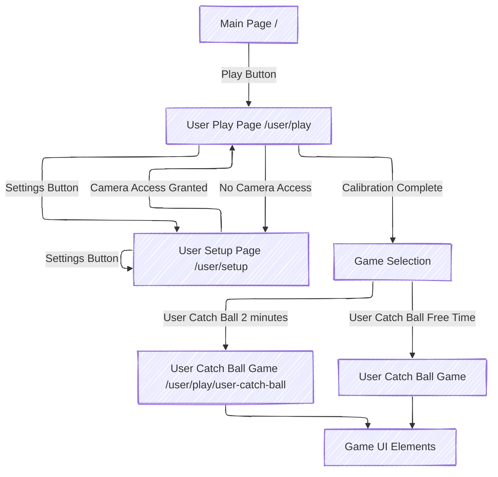

# Description for Move Playground

1. **Global Component**

   - All pages contain a **Settings Button** that navigates to `/user/setup` to allow the user to choose the current active camera.

2. **Main Page /**

   - **Hero Section**: Displays the main tagline: *Move, Play, Control*.
   - **Regular Text**: Description of the gameplay.
   - **Play Button**: On click, the user is navigated to `/user/play`.

3. **User Play Page /user/play**

   - **Camera Access Check**: If camera access is not available, the user is redirected to `/user/setup`.
   - **Calibration Screen**: Before starting, a calibration screen component ensures that the entire torso is detected by TensorFlow Pose Detection.
   - **Game Selection**: Once calibration is complete:
     - Display: "We are ready, what game you want to play?"
     - **Game List**:
       - *User Catch Ball (2 minutes)*: Navigates to `/user/play/user-catch-ball/2minutes`
       - *User Catch Ball (Free Time)*: Navigates to `/user/play/user-catch-ball/no-time-limit`

4. **User Catch Ball Game /user/play/user-catch-ball**

   - **Extra Parameter Check**: Checks for the presence of a time limit parameter (`2 minutes` or `no-time-limit`). Default is `2 minutes` if no parameter is provided.
   - **Game UI Elements**:
     - **Title**: "Catch the ⚽ and stay away from the 🎈!"
     - **Scoreboard**: Displays the number of each type of ball collected and a countdown timer (minutes and seconds).
     - **Video Display**: Displays the user's video feed with TensorFlow Pose Detection (poses are overlaid on the video).
     - **Ball Positions**: Shows balls in a `6 x 6` matrix on the screen.
     - **Interaction Mechanism**: When the wrist position is detected touching a ball, the ball is removed from the screen and a new ball is introduced in a different position.

5. **User Setup Page /user/setup**

   - **Camera Access Instructions**:
     - If the camera is not accessible or permissions have not been given, a message instructs the user to allow camera access.
     - Message: "To start, you'll need to allow camera access. Click on START and follow the prompt, click 'Allow,' and you're good to go!"
     - Once camera access is granted, the information is saved in `localStorage` for future use.
     - **Link to Play Page**: Once the camera is found, a link is provided to navigate to `/user/play`.

### User Flow Diagram (Mermaid)

## Technical requirements 

- Create a next.js client side only rendering application
- Use typescript 
- Use https://daisyui.com for ui components
- React router for page navigation https://reactrouter.com/en/main/start/overview
- Keep application state using https://github.com/pmndrs/zustand 
- Generate tests using https://jestjs.io
- When making async calls use Suspense and a error boundary component https://react.dev/reference/react/Suspense 
- When fetching remote data use https://axios-http.com
- All text in the ui should translatable to English-US and Portuguese-Brazil using https://formatjs.io/docs/react-intl/
- The game implementation should be done using https://pixijs.io/pixi-react

