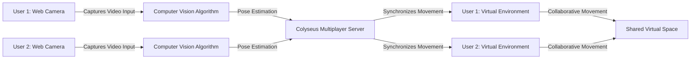

# Move playground
This project aims to explore the capabilities of real-time motion capture using computer vision algorithms via web cameras, leveraging pose estimation models to detect skeletal structures and body movement. The captured motion data will be processed through machine learning algorithms for accurate pose detection and tracking. For synchronization, the Colyseus multiplayer server will be utilized to ensure low-latency and efficient state management. This allows multiple users to join and have their body movements accurately reflected in real-time within a collaborative virtual environment.

# First version 
- Indentify skeletal - OK 
    - Preview overlay in the video - OK
    - Choose video source - OK 
    - Draw lines to connect the key body parts

- Sync to Colyseus server
- Display as 3D spheres

# MVP 
The goal of the initial version is to allow a remove shared experience during the halloween of 2024.

- Research skeletal structure libraries - OK 
- Identify skeletal structure nomenclature and compatible 3D models
- Build first end to end synchonization implementation
- Add URL option to display only the 3D rendering, to be watched in a separated screen

# Next steps 

- Track events in a kafka stream
- Receive events sequence using https://temporal.io and generate videos
- Post videos to twitter 
- Allow the creation of separated rooms

